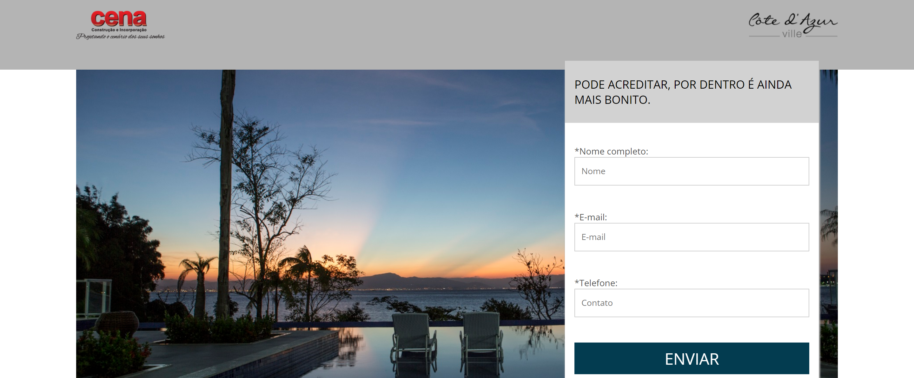
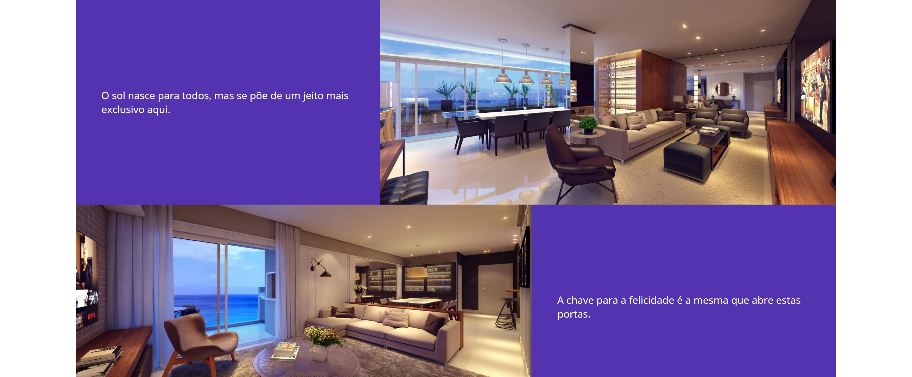
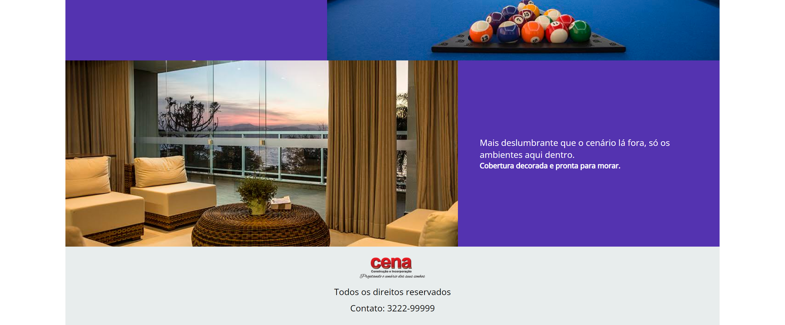

<h1 style="text-align: center; font-weight: bold;">Site de hotel</h1>

## Demonstração 📸

  
  
  

---

## Sobre o Projeto

Um dos meus primeiros projetos com HTML5 e CSS3.

### 🛠 Tecnologias

As seguintes ferramentas foram usadas na construção do projeto:

- [HTML5]
- [CSS3]
---

 

Veja meu Linkedin: [LEANDRO ARAÚJO](http://www.linkedin.com/in/leandro-ara%C3%BAjo-da-silva-1660631b9)
